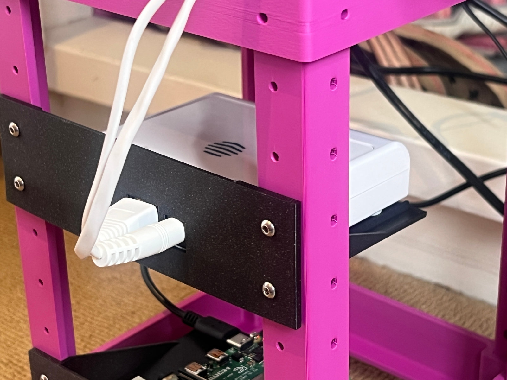

# Microlab 1U Hive Hub tray

I love CB4D's [Microlab - Mini Modular Home Server Rack](https://www.printables.com/model/1173286-microlab-mini-modular-home-server-rack).

This is a tray for the [Hive Hub](https://www.hivehome.com/shop/smart-home/hive-hub), although mine has a grey logo so the new one might be slightly different.

It's an easy print without supports.

I used OnShape to sketch it out.

https://www.printables.com/model/1229547-microlab-1u-hive-hub-tray

## License

CC BY 4.0

## Author

Original author CB4D.
Remix by Leon Brocard <acme@astray.com>
